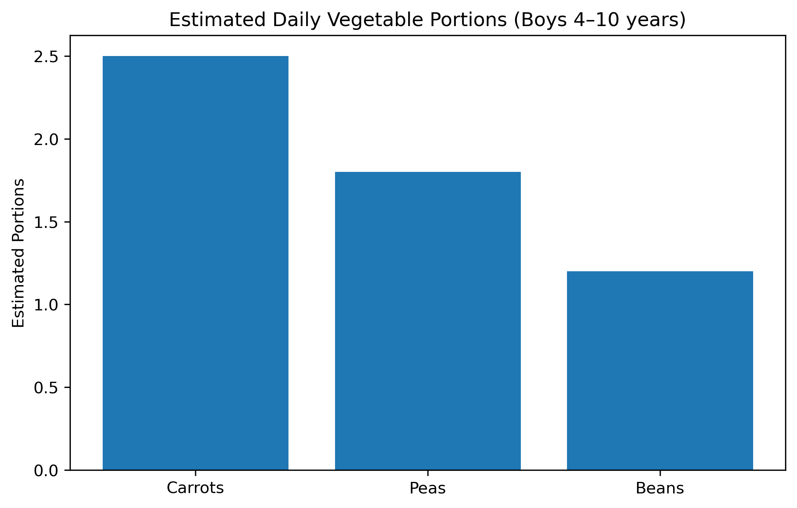

# UK Kids' Vegetable Habits: Do They Stick Into Adulthood?

This project explores UK National Diet and Nutrition Survey (NDNS) data (2019–2023) to understand whether **eating vegetables as a child** leads to **healthier eating habits later in life**.

## Key Question

> Do children who consume vegetables early in life maintain that habit as they grow into adults?

## Summary of Findings

- Only **9% of children aged 11–18** meet the “5 A Day” guideline.
- Adult intake averages **3.3–3.7 portions per day**, still well below target.
- Vegetarianism is rare: **<3%** across all age groups.
- **Healthy habits do not strongly persist** into adulthood — public health interventions are needed.

## 📈 Sample Visual

### Vegetable Intake – Boys Aged 4–10

---

## Data Source

Data from the UK National Diet and Nutrition Survey:
> [NDNS 2019–2023, UK Gov](https://www.gov.uk/government/statistics/national-diet-and-nutrition-survey-uk-results-from-years-12-to-15-2019-to-2023)

---

## Author

**BP**  
_Senior Data Analyst passionate about health, nonprofits, and turning data into impact._  
[GitHub](https://github.com/Biguftj)

---

## 📬 Get in Touch

If you're interested in collaborations, data storytelling, or nonprofit impact analysis — feel free to connect!

